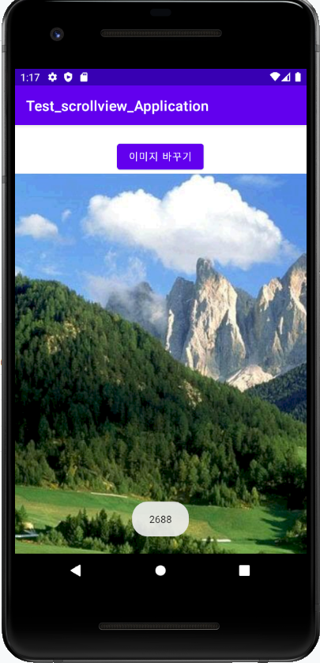

# 캡스톤디자인 안드로이드앱프로그래밍

## 1주차

## 2주차
  - Github 사용법
  - 안드로이드앱 프로그래밍 시작
    - toast 알림
    - avd 시작하기
 
</img>

## 4주차

  - 아이디어 명 : 광고 없는 맛집 추천
  - 어플 설명 : 누구나 실패 없는 맛집을 찾기 위해 네이버 검색, 인스타그램, 페이스북 검색을 해봤을 것이다. 하지만 요즘은 대다수가 유료 광고 포스팅이라 광고가 아닌 맛집을 찾는 것이 쉽지 않다. 추천글을 업로드할 때 캡쳐 혹은 타인으로부터 받은 사진이 아닌 직접 찍은 음식 사진과 카드 결제 내역 혹은 영수증 사진을 첨부해야만 업로드할 수 있다면 더욱 신뢰가 갈 것이다. 사용자의 위치에 따라 주변 맛집을 검색해주며 후기들을 보여준다.

## 5주차
</img>

## 6주차
</img>
